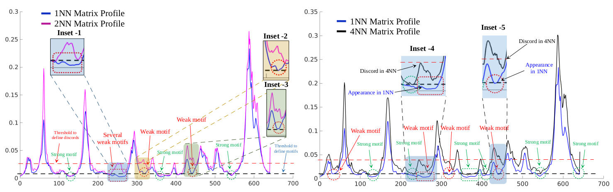
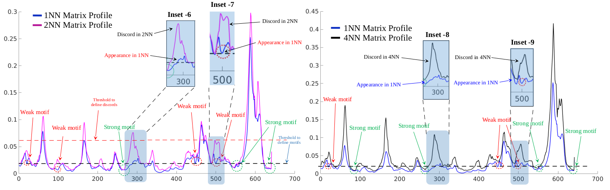
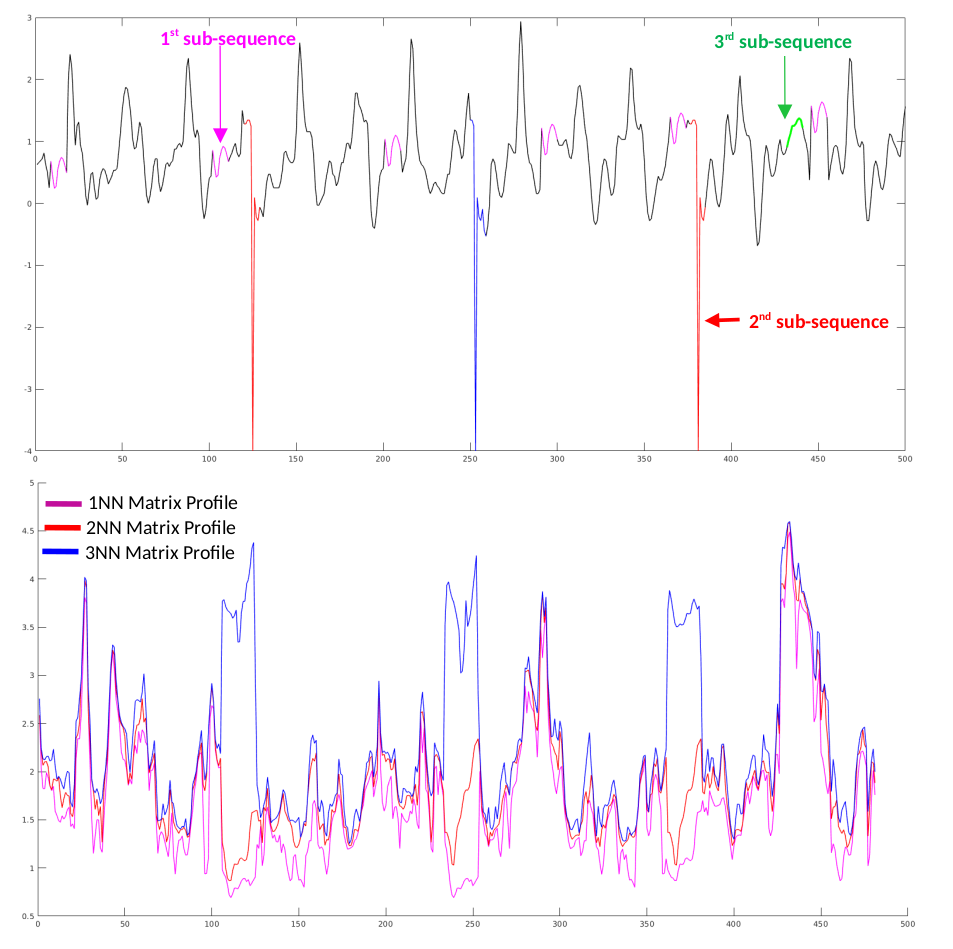

<p align="center">
  For the details of the algorithm see, the this article </p>
<h1> Matrix Profile Based kNN Search over Large Time Series </h1> 
<h4> Tanmoy Mondal, Reza Akbarinia, Florent Masseglia <br/> </h4>
<h6> INRIA & LIRMM, Univ. Montpellier, France </h6>  <br/> <br/> <br/>


The interest of kNN search over 1NN search is shown in Fig. 5 and 6
  (following two figures) of the article. To generate these plot, run the following code and follow the instructions mentioned inside these code :
```matlab
-- Journal_Exp_1.m
-- Journal_Exp_2.m
```


*Fig. The 1NN v/s 2NN matrix profile and 1NN v/s 4NN matrix profile of one part of the  complete time series is plotted. The motifs and discords are illustrated in the plot.*

*The 1NN v/s 2NN matrix profile and 1NN v/s 4NN matrix profile of one part of the  complete time series. The motifs and discords are illustrated in the plot*


The use case, mentioned in Fig. 8 (following figure) can be obtained by running the code :
```matlab
-- outliers_plot.m
```

<p align="center">
  
</p>
Fig. Special case of the outliers presence is depicted by considering a toy time series (top). The 1NN, 2NN and 3NN matrix profiles are shown for the time series (bottom)


